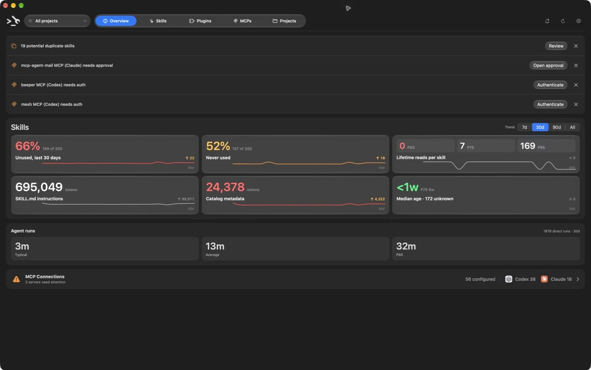

<p align="center">
  
</p>

<p align="center">
  A native control center and local analysis toolkit for coding-agent skills, MCP servers, and project instructions.
</p>

Metagent answers the questions that get difficult once several agents, plugin
systems, and skill managers share one machine:

- Which skills and MCP servers are available globally or for this project?
- Who owns each skill, and which copy is canonical?
- Which skills are actually being read in retained Codex sessions?
- Which configurations need attention, and which are simply disabled?
- What should an agent know about a repository before it starts work?

The macOS app is the primary human interface. The `metagent` CLI and MCP server
expose the same Swift core to terminals and agents.

> **Status:** early developer preview for macOS 26+ on Apple Silicon. Inventory
> and usage history stay on your Mac. The native app sends anonymous aggregate
> product analytics to PostHog by default; you can switch this off in Settings.
> Optional Codex skill review sends only the selected, bounded skill copy to
> OpenAI after confirmation.

## Quick install

1. Download the latest signed and notarized [Metagent DMG](https://github.com/ianwatts22/metagent/releases/latest/download/Metagent.dmg).
2. Open the DMG and drag Metagent into Applications.
3. Open Metagent. Future production updates arrive through Sparkle.

Requires macOS 26 or newer and an Apple Silicon Mac.



## What it includes

### Native macOS app

- One directory filter across Overview, Skills, and MCP inventory.
- Unified skill inventory and usage views with native sorting, filtering,
  multi-selection, column customization, and manager-aware removal.
- Stable **Quality**, usage-aware **Utility**, external **Plugin Eval**, and
  optional **Codex review** signals kept separate.
- Passive Codex and Claude MCP configuration health with explicit global,
  project, sign-in, approval, disabled, and unavailable states.
- Doctor findings grouped into actionable project-level cleanups.

### Project analysis CLI

Analyze the current folder or any explicit project:

```bash
metagent analyze --root /absolute/path/to/project --json
```

The report combines project instructions, skills and provenance, retained usage,
relevant MCP configuration, plugin inventory, and Doctor findings.

Narrower commands are also available:

```bash
metagent inventory --json
metagent skills list --global --sort invocations_30d --order desc --limit 20
metagent skills show /absolute/path/to/skill --no-body
metagent skills duplicates --global
metagent skills scan --root /absolute/path/to/project --json
metagent skills doctor --root /absolute/path/to/project --json
metagent skills evaluate /absolute/path/to/skill --provider plugin-eval --json
metagent codebase --root /absolute/path/to/project --json
metagent usage status --json
```

`metagent codebase` sizes a git repository from the files git lists, split into
code, tests, documentation, configuration, generated output, and assets.
Untracked ignored build output and dependencies do not reach the count; generated
output that was committed still does. The test, documentation, generated, and
long-file ratios show whether the maintained repository is carrying slop.

`metagent skills list` is the compact, paginated view: it filters by `--name`,
`--manager`, `--mutability`, `--min-score`, `--unused`, and
`--used-within-days`, sorts by `--sort`/`--order`, pages with
`--limit`/`--cursor`, and shrinks further with `--no-descriptions`. Like
`metagent skills duplicates`, it reads the current folder unless you pass
`--root PATH` or `--global`.

Removing skills accepts one or more names and previews by default:

```bash
metagent skills remove NAME [NAME...] --root /absolute/path/to/project
metagent skills remove NAME --root /absolute/path/to/project --apply
```

The dry run reports the removal method, owning manager, and mutability per
skill. `--apply` moves the skill and its projections into recovery state and
prints the recovery path rather than deleting them outright.

### Local MCP server

Agents can consume the same project-analysis contract over stdio:

```bash
metagent mcp --stdio
```

The MCP layer is intentionally thin: scanning, health, usage, and analysis remain
in `MetagentCore` rather than being reimplemented for each interface.

After installing the CLI, preview and apply user-scoped registration through
each client's supported MCP commands:

```bash
metagent mcp install --client codex
metagent mcp install --client codex --apply

metagent mcp install --client claude
metagent mcp install --client claude --apply
```

Check configuration and the direct stdio protocol handshake:

```bash
metagent mcp status
metagent mcp status --client codex --json
```

Existing agent sessions may need to be restarted before the newly registered
server appears. Configuration and a direct handshake do not prove that a client
has loaded, connected to, or invoked it.

The server exposes eight read-only tools: compact project analysis through
`analyze_project`, bounded and paginated drilldown through
`get_project_analysis_details`, the compact paginated inventory in
`list_skills`, the global root overview in `list_projects`, overlap groups in
`find_duplicate_skills`, one skill's detail in `get_skill`, git-tracked codebase
size in `measure_codebase_size`, and `doctor_project`. It also exposes
`remove_skills`, which is destructive: it defaults to `apply: false` and returns
only a dry-run plan, and agents must get explicit user confirmation for the
specific removal before applying. For example, ask an agent:

> Use Metagent to analyze this project’s instructions, skills, MCP setup,
> provenance, usage evidence, and Doctor findings.

The guided commands never rewrite client configuration files directly. See
[MCP installation and verification](docs/mcp-installation.md) for preview,
removal, JSON output, and runtime-state semantics.

### Agent skill

The publishable Metagent skill lives at
[`.agents/skills/metagent/`](.agents/skills/metagent/) and teaches agents how to
reason about tool availability, skill provenance, usage evidence, and durable
instruction ownership.

Install it globally with the Skills CLI:

```bash
npx skills add ianwatts22/metagent --skill metagent --global
```

## Install from source

Requirements:

- macOS 26 or newer
- Xcode with a Swift toolchain
- an Apple Development signing identity for local app installation

Clone the repository, then install the app and command-line helper:

```bash
git clone https://github.com/ianwatts22/metagent.git
cd metagent
scripts/install-app.sh --restart
scripts/install-cli.sh
```

The source-built app is installed at `~/Applications/Metagent Dev.app`; the CLI
is installed at `~/.local/bin/metagent`. Production `Metagent.app` is installed
from the signed DMG and updated only through Sparkle.

For development:

```bash
scripts/dev-app.sh
```

## Data and privacy

Metagent stores generated state outside the repository:

- inventory: `~/Library/Application Support/Metagent/inventory.sqlite`
- skill usage: `~/Library/Application Support/Metagent/usage.sqlite`
- evaluations: `~/Library/Application Support/Metagent/skill-evaluations-v1.json`

Usage history is derived from observed `SKILL.md` reads in retained Codex JSONL
sessions. Metagent stores normalized identity, timestamps, thread/turn IDs, and
evidence metadata—not prompts or tool-output content. Missing telemetry is never
treated as proof that a skill is useless.

Passive MCP health reads local client configuration. It does not start servers,
contact providers, inspect secrets, or claim that a configured server was
successfully invoked.

The native app sends four anonymous product events to PostHog: app launch,
inventory scan completion, skill publication enabled, and publication sync
completion. Events contain only the app version, build, channel, an outcome,
and broad count ranges. They never contain skill names or content, file paths,
account details, prompts, logs, or screen recordings. A random install ID keeps
events from one installation together without an account or identity lookup.
Turn off **Share anonymous usage data** in Settings to stop all app analytics.

Optional Codex review is separate from analytics. It sends the selected skill
and bounded project context to OpenAI only after explicit confirmation.

## Architecture

Swift is the source of truth:

- `MetagentCore` owns inventory, provenance, usage, Doctor, MCP health, and
  project analysis.
- `MetagentMenuBar` imports the core directly for the native UI.
- `metagent` is a thin headless wrapper for CLI and MCP access.

Machine-local roots, secrets, account mappings, logs, and generated state stay
outside the repository. See [architecture](docs/architecture.md),
[skill provenance](docs/skill-provenance.md), [skill scoring](docs/skill-scoring.md),
[skill projection](docs/skill-projection.md), [macOS app behavior](docs/menu-bar.md), and
[adjacent tools and product inspiration](docs/adjacent-tools.md) for details.

## License

Metagent is available under the [MIT License](LICENSE).

## Verify

Use the fast lane while iterating:

```bash
scripts/verify-fast.sh
```

Run focused integration or release packaging checks when those surfaces change:

```bash
scripts/verify-integration.sh
scripts/verify-release.sh
```

Before pushing a finished change, run the complete gate:

```bash
scripts/verify.sh
```

## Contributing

Bug reports and focused proposals are welcome through
[GitHub Issues](https://github.com/ianwatts22/metagent/issues). Please run
`scripts/verify.sh` before opening a pull request.
